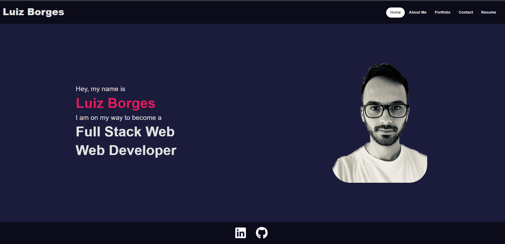

# Luiz Borges Portfolio

* [GitHub repository](https://github.com/luizborges146/luizborges-portfolio)<br />
* [Live link](https://luizborges146.github.io/luizborges-portfolio/#home)<br />

 [](https://opensource.org/licenses/MIT)


    
## Table of Contents
    
1.  [Description](#description)
2.  [Instalation](#instalation)
3.  [Usage Infomration](#usage)
4.  [External support documentation](#externalDoc)
5.  [Tests](#tests)
6.  [Social](#social)
7.  [Plugins](#plugins)
8.  [License](#license)
    
## [Description](#description)
The idea of this application is to be able to manipulate the data using react components, with that in mind, the user can choose from navigating through the Home, About Me, Portfolio Contact and Resume. After the user navigate and check the pages, it will have an opportunity to send me a message or download my resume.





## [Instalation](#instalation)
In order to use test this application, you will be able to run the NPM INSTALL and then NPM START.

    
## [Usage](#usage)
Simple to use.
 * Functionalities.
   * Home Page
   * About me, information about what I have experience and what I am looking for my next journey.
   * Portfolio show some of the work I have done, and also links to my github repo.
   * Contact is a form so the user can contact me for more information.
   * Resume with the skill I learned on the Bootcamp plus the option to download my resume.


#### To identify if the user added a proper email format on the form
```js
export function validateEmail(email) {
    const re = /^(([^<>()[\]\\.,;:\s@"]+(\.[^<>()[\]\\.,;:\s@"]+)*)|(".+"))@((\[[0-9]{1,3}\.[0-9]{1,3}\.[0-9]{1,3}\.[0-9]{1,3}\])|(([a-zA-Z\-0-9]+\.)+[a-zA-Z]{2,}))$/;
    return re.test(String(email).toLowerCase());
  }
  
```

#### This method is checking to see what the value of `currentPage` is. Depending on the value of currentPage, we return the corresponding component to render.
```js
const renderPage = () => {
    if (currentPage === 'Home') {
      return <Home />;
    }
    if (currentPage === 'About') {
      return <About />;
    }
    if (currentPage === 'Portfolio') {
      return <Portfolio />;
    }
    if (currentPage === 'Resume') {
      return <Resume />;
    }
    return <Contact />;
  };
```

  

## [External support documentation](#externalDoc)
    

- [W3School](https://www.w3schools.com/)<br />
- [Mozilla](https://developer.mozilla.org)<br />
- [READ.me](https://docs.readme.com/docs/linking-to-pages")<br />
- [GitHub](https://pages.github.com/)<br />
- [npm inquirer GitHub link](https://github.com/SBoudrias/Inquirer.js/blob/master/README.md#installation)<br />
- [npm mongoose](https://mongoosejs.com/docs/validation.html)<br />
- [npm](https://www.npmjs.com/)<br />
- [Template Literals](https://developer.mozilla.org/en-US/docs/Web/JavaScript/Reference/Template_literals)<br />


    
## [Tests](#tests)
N/A
    
## [Social](#social)
if you need any further information or support, please, send an email to: luiz.borges.146@gmail.com
    
[](https://github.com/luizborges146) [](https://www.linkedin.com/in/luiz-borges-2377b7142/)
    
    
    
## [Plugins](#plugins)
N/A
    
## [License](#license)
License Information: [MIT](https://opensource.org/licenses/MIT);

Created by Luiz Borges
Please refer to the LICENSE in the repo.
